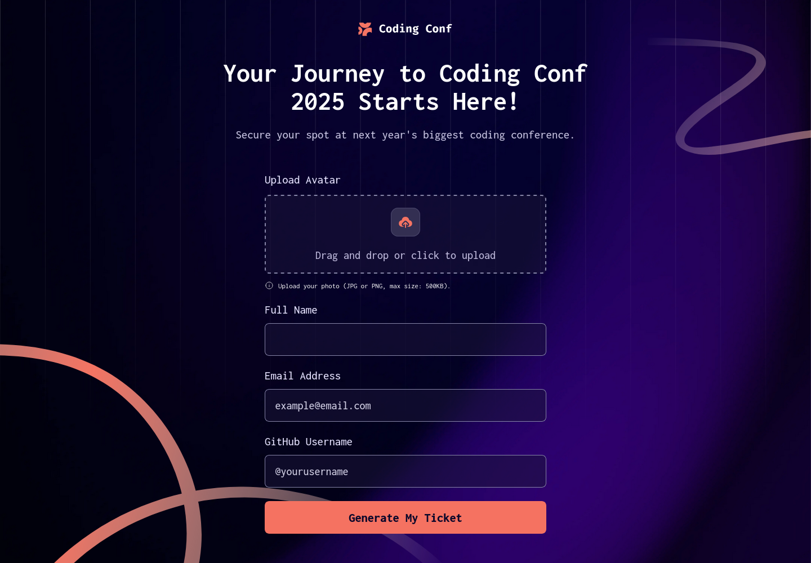

# Frontend Mentor - Conference ticket generator solution

This is a solution to the [Conference ticket generator challenge on Frontend Mentor](https://www.frontendmentor.io/challenges/conference-ticket-generator-oq5gFIU12w). Frontend Mentor challenges help you improve your coding skills by building realistic projects.

## Table of contents

- [Overview](#overview)
  - [The challenge](#the-challenge)
  - [Screenshot](#screenshot)
  - [Links](#links)
- [My process](#my-process)
  - [Built with](#built-with)
  - [What I learned](#what-i-learned)
  - [Continued development](#continued-development)
  - [Useful resources](#useful-resources)
- [Author](#author)

## Overview

### The challenge

Users should be able to:

- Complete the form with their details
- Receive form validation messages if:
  - Any field is missed
  - The email address is not formatted correctly
  - The avatar upload is too big or the wrong image format
- Complete the form only using their keyboard
- Have inputs, form field hints, and error messages announced on their screen reader
- See the generated conference ticket when they successfully submit the form
- View the optimal layout for the interface depending on their device's screen size
- See hover and focus states for all interactive elements on the page

### Screenshot

### Links

- Solution URL: [My Solution](https://www.frontendmentor.io/solutions/conference-ticket-generator-mb-5P8Y2gGktq)
- Live Site URL: [Live](https://matiasbastarrica.github.io/conference-ticket-generator/)

## My process

### Built with

- Semantic HTML5 markup
- CSS custom properties
- Flexbox
- CSS Grid
- Mobile-first workflow
- JavaScript

### What I learned

I learned to use the HTML Drag and Drop API along with the File API. I also learned how to link the drag and drop with the file input in order to validate the form whether a file was dropped or selected using the input.

### Continued development

In the future I'd like to continue to work with Web API.

### Useful resources

- [Drag and Drop API](https://developer.mozilla.org/en-US/docs/Web/API/HTML_Drag_and_Drop_API/File_drag_and_drop) - This helped me to get a general idea how to manage the "drag and drop" funcionality.
- [Data transfer](https://developer.mozilla.org/en-US/docs/Web/API/DataTransfer#examples) - This is article helped me to implement the drag and drop API. I'd recommend it to anyone still learning this concept.
- [File](https://developer.mozilla.org/en-US/docs/Web/API/File#instance_properties) - This is article helped me to handle the selected file using the file input.
- [Blob](https://developer.mozilla.org/en-US/docs/Web/API/Blob) - This helped me to check the size of the selected size in order to validate the input.
- [Using files from web applications](https://developer.mozilla.org/en-US/docs/Web/API/File_API/Using_files_from_web_applications#using_hidden_file_input_elements_using_the_click_method) - This guide help me to check get a general sense of how to handle the drag and drop API as well as the file input.
- [file input](https://developer.mozilla.org/en-US/docs/Web/HTML/Reference/Elements/input/file#see_also) - This article help me to understand how to work with the file input.
- [Constraint Validation API](https://developer.mozilla.org/en-US/docs/Web/HTML/Guides/Constraint_validation) - This article help me to understand how to validate the form.
- [Client-side form validation](https://developer.mozilla.org/en-US/docs/Learn_web_development/Extensions/Forms/Form_validation#validating_forms_using_javascript) - This guide help me to get an overview of how the ways that I can validate a form on the client side

## Author

- Frontend Mentor - [@MatiasBastarrica](https://www.frontendmentor.io/profile/MatiasBastarrica)
